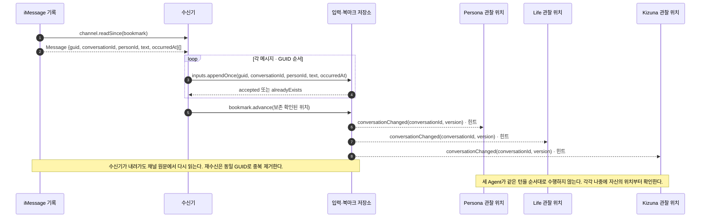
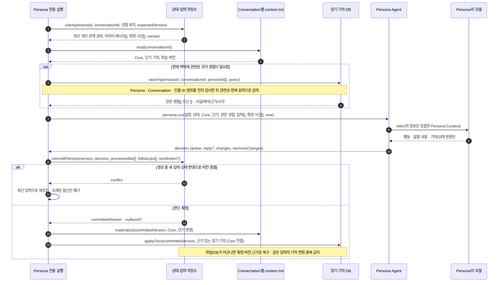
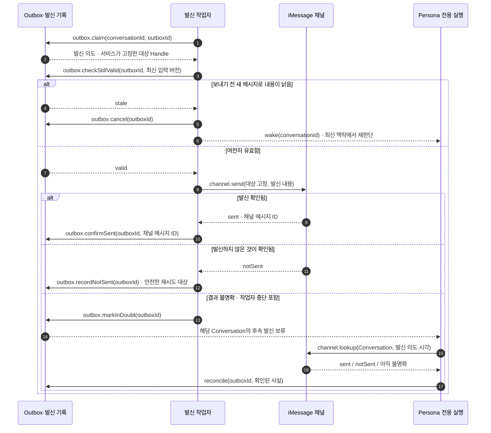
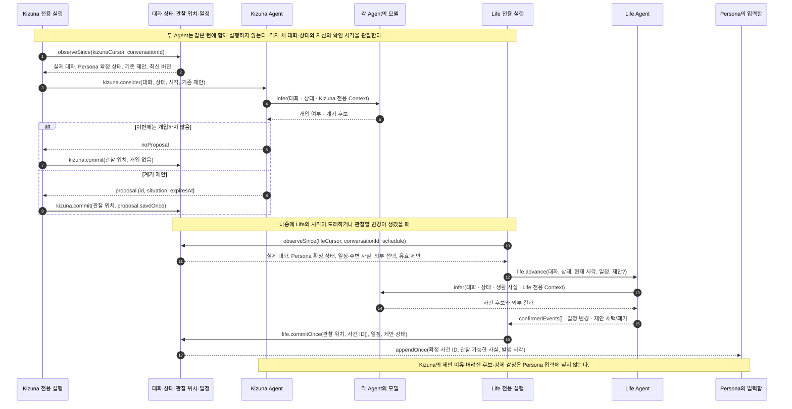
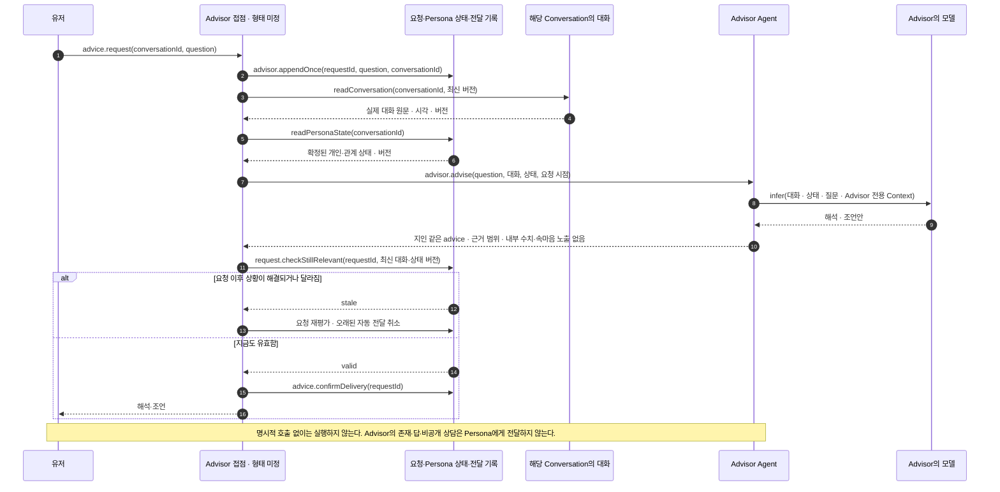
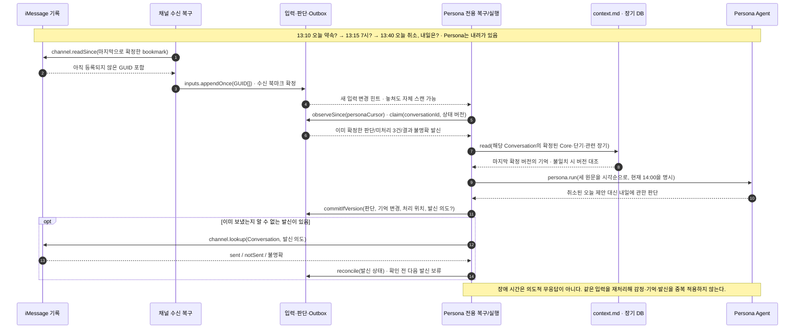

# Agent 실행 · Context 주입 · 호출 순서

[Agent lifecycle · 전체 흐름](agent-runtime-lifecycle.md) · [구성요소 아키텍처](agent-runtime-architecture.md) · [원본 스펙](agent-runtime.md)

**장기 방향의 논리적 API 호출도**다. `inputs.appendOnce` 같은 이름은 역할 사이의 계약을 보여 주기 위한 표기이며, 실제 HTTP 경로·프로세스 개수·데이터베이스 테이블을 확정하지 않는다. `DB`는 서비스의 지속 상태를 뜻하고, iMessage의 실제 Conversation 원문은 채널에서 확인한다. Persona·Life·Kizuna는 같은 대화·상태 변화를 **서로 다른 관찰 위치와 시각**에서 읽는다. 모델 호출은 각 Agent의 **자기 Context**만 사용하며, Advisor는 유저가 호출할 때만 실행한다.

## 1. 채널에서 받은 메시지를 잃지 않기



수신 사실을 기록하기 전에 처리 위치부터 진행시키지 않는다. `personId`는 현재 유저를 식별하는 안정적인 ID이며, 이름이나 Handle과 혼용하지 않는다. 위 신호는 실행을 돕는 힌트일 뿐이다. Life와 Kizuna는 대화·상태 변경을 각자 관찰하고, 신호가 유실되어도 자기 관찰 위치부터 다시 읽는다. Advisor에는 신호를 보내지 않는다. Persona가 이미 메시지를 읽었지만 답하지 않기로 했더라도, **입력을 처리한 것**과 **발신한 것**은 별개로 보존한다.

## 2. Persona가 실행될 때: 읽기 → 주입 → 판단 → 확정



**주입되는 모습의 예시** (`c-17`과 `p-42`는 예시 ID):

```text
Persona 설정: 하린의 말투·가치관·알 수 있는 범위
Conversation 범위: c-17 / 민서 (인물 ID: p-42)
확정 상태: 지금의 개인 상태와 민서와의 관계
Core: 민서가 발표 이야기를 재촉하지 않고 들어줬다. 나는 더 솔직해져도 괜찮겠다고 느낀다. (근거 e-17)
단기: 내일 발표가 있다. 민서의 마지막 질문에는 아직 답하지 않았다.
관련 장기 기억: 발표 준비에 대한 사실 / 당시의 내 해석 / 출처·시각 (검색된 경우에만)
새 입력: [13:10 약속 제안, 13:15 시간 확인, 13:40 오늘 취소·내일 제안] 원문 그대로
확정 생활 사건: Persona가 이미 알게 된 사건만
현재 시각: 14:00
```

이는 **전달 정보의 예시**이지 확정된 프롬프트 형식이 아니다. Core·단기는 항상, 장기는 필요한 경우에만 들어간다. 이름 `민서`만으로 다른 사람의 기억을 검색하지 않으며 `유저가 ...` 같은 모호한 기억을 만들지 않는다. Kizuna의 기획 이유, Life의 미확정 후보, Advisor 상담은 주입하지 않는다. Persona가 대답 대신 기다리기로 해도 변경안과 처리 위치는 한 번만 확정된다.

`commitIfVersion`은 **논리적으로 하나의 확정 단계**다. `context.md`와 DB는 서로 다른 매체이므로 물리적 단일 트랜잭션을 가정하지 않는다. 어떤 확정 버전에서 파일을 다시 만들어야 하는지, 실패 시 어떻게 대조할지는 구현에서 정해야 한다. 발신은 이 단계가 끝나기 전에 시작하지 않는다.

확정된 Persona 상태 변화는 Life와 Kizuna가 **각자의 관찰 위치에서 나중에 확인할 새 버전**이 된다. 이 커밋이 Life나 Kizuna의 모델을 즉시 호출하지 않으며, Advisor도 자동으로 실행하지 않는다.

## 3. 발신: Persona의 의도와 실제 전송 사이



Persona는 수신자나 셸 명령을 선택하지 않는다. 서비스가 해당 Conversation에 묶인 대상에게만 발신한다. **결과 불명확 ≠ 실패 확정**이므로 재전송 전에 채널 기록과 대조한다. 답장 예약 뒤 새 메시지가 쌓인 경우 기존 발신안의 유효성을 다시 판단한다.

## 4. 관계 이벤트와 일상의 API 경계



Kizuna가 멈춰도 Life의 일상과 Persona의 대화는 이어진다. Life가 멈춰도 Kizuna는 대화·상태를 관찰하고 제안을 남길 수 있으며 Persona는 이미 확정된 사실로 대화한다. 각 역할은 복귀할 때 자기 관찰 위치와 현재 상태를 다시 읽고 오래된 제안을 전부 실행하는 대신 **현재도 유효한지** 확인한다. 둘 다 Persona의 감정·답장 내용을 지정하지 않는다.

## 5. Advisor: 별도 요청·별도 결과



Advisor는 제품 안에서만 두 사람을 아는 지인처럼 조언하는 **호출형 치트키**다. 실제 대화와 Persona의 확정된 상태를 볼 수 있지만, 상태를 유저에게 수치나 확정적인 속마음으로 공개하거나 정답 문장을 지시하지 않는다. 먼저 연락하지 않고 Persona의 세계에 등장하지도 않는다. 접점과 전송 방식은 미결정이며, 위 호출을 확정된 웹 API로 읽지 않는다.

## 6. 중단·재시작 후 같은 사실에서 이어가기



같은 복구 시점에 Life와 Kizuna도 **자기 관찰 위치**와 현재 대화·Persona 상태를 각각 대조한다. Life는 지나간 확정 일정을 따라잡고, Kizuna는 시효가 지난 제안을 폐기한다. Advisor는 미처리된 유저의 요청이 있는 경우에만 재개한다. 어느 하나가 복구될 때 다른 Agent의 다음 턴을 중앙에서 순서대로 실행하지 않는다.

이 흐름의 **제품 요구**는 스펙에 있지만, 메시지별 OpenCode 프롬프트를 유지하면서 누적 메시지를 어떻게 함께 판단할지, 세션 압축과 명시적 기억 중 무엇을 복구 기준으로 둘지는 [원본 스펙의 열린 결정](agent-runtime.md#기존-설계와의-접점-및-열린-결정)이다. 위 호출도는 그 결정을 대신하지 않는다.
