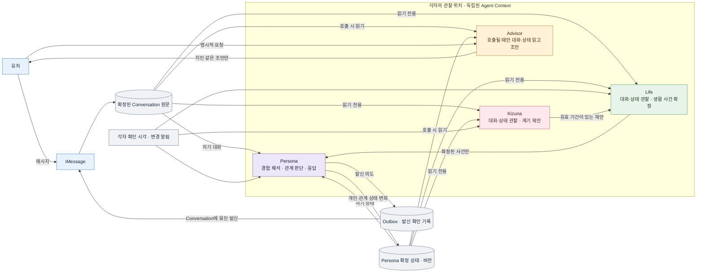
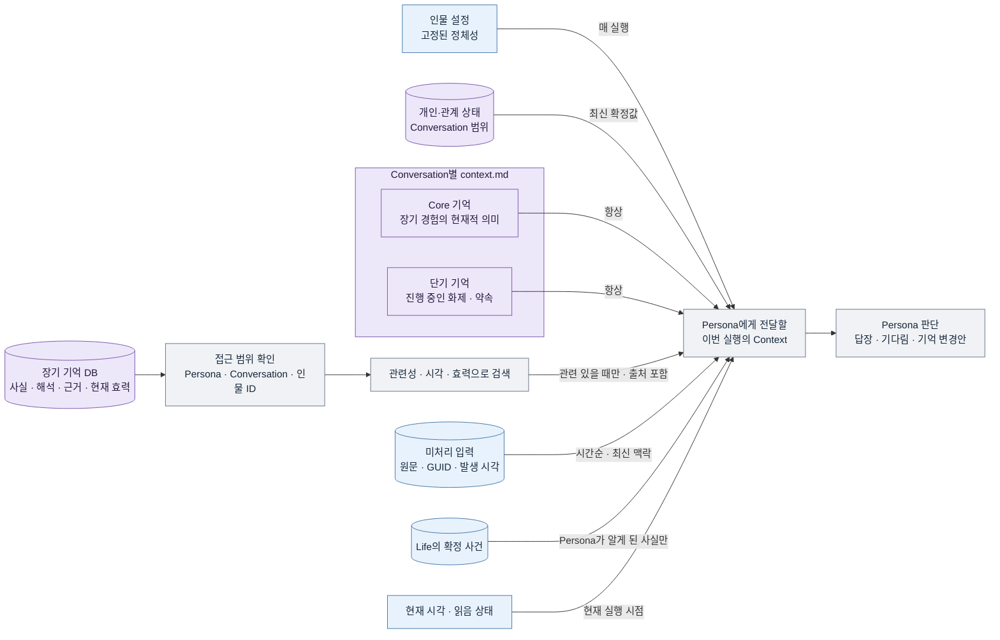

# Agent 아키텍처 · 읽는 순서

[Agent lifecycle · 전체 흐름](agent-runtime-lifecycle.md) · [실행 순서와 호출 계약](agent-runtime-api-flow.md) · [원본 스펙](agent-runtime.md)

이 도면들은 **장기적으로 만들 구조**다. 상자는 독립 실행 역할 또는 지속 기록이고, 화살표는 경계를 넘어 전달되는 **관찰 또는 결과**다. 중앙 실행 조정자가 한 턴의 역할을 선택하지 않는다. Persona·Life·Kizuna는 각자 새 대화·상태나 자신의 시각을 확인한다. Advisor는 유저의 호출 때만 최신 대화·상태를 읽는다. 네 Agent가 같은 프롬프트나 세션을 공유한다는 뜻은 아니다.

## 1. 누가 누구에게 무엇을 전달하는가

**읽는 법:** 대화·상태 변화는 각 Agent가 **나중에 각자의 시각에 관찰할 수 있는 사실**이지 네 Agent를 한 턴에 연쇄 실행하는 명령이 아니다. Life가 전달하는 것은 사건이지 Persona가 느껴야 할 감정이 아니다. Kizuna의 제안은 Life가 확정하기 전까지 Persona에게 보이지 않는다. Persona가 외부에 실행한 선택도 다음 Life 실행의 입력이 된다([호출 순서](agent-runtime-api-flow.md#4-관계-이벤트와-일상의-api-경계)). Advisor의 상담은 Persona의 입력으로 되돌아가지 않는다. Agent별 관찰 위치·작업 기록은 복구하되, **주관적 기억을 갖는 역할은 Persona뿐**이다.

| 읽는 것                              | Persona                  | Life          | Kizuna        | Advisor          |
| ------------------------------------ | ------------------------ | ------------- | ------------- | ---------------- |
| 해당 Conversation의 실제 대화        | 자신의 대화              | 읽음          | 읽음          | 호출 시 읽음     |
| Persona의 확정된 개인·관계 상태      | 자신의 상태              | 읽음          | 읽음          | 호출 시 읽음     |
| Persona의 Core·단기·장기 주관적 기억 | 자기 Context에 주입/검색 | 공유하지 않음 | 공유하지 않음 | 공유하지 않음    |
| Agent별 미확정 계획·상담             | 남의 계획을 모름         | 자기 계획만   | 자기 계획만   | 자기 요청·결과만 |

## 2. Persona가 실행될 때 Context는 어떻게 조립되는가

| 조립 단계 | Persona에게 실제로 들어가는 내용                                             | 경계                                                                                 |
| --------- | ---------------------------------------------------------------------------- | ------------------------------------------------------------------------------------ |
| 항상      | Persona 설정, 해당 Conversation의 확정 상태, `context.md`의 Core·단기 영역   | 다른 Conversation의 관계 기억을 넣지 않는다.                                         |
| 조건부    | 장기 DB에서 찾은 관련 경험과 **근거·시각·사실/해석 구분**                    | 검색 **전에** Persona·Conversation·인물 ID 범위를 확인한다. 결과가 없으면 빈 결과다. |
| 이번 실행 | 아직 처리하지 않은 실제 메시지·관찰한 생활 사건·현재 시각                    | 메시지 원문과 발생 시각을 보존하고 오래된 제안을 현재 사실처럼 넣지 않는다.          |
| 제외      | Kizuna의 목표·버린 후보, Advisor의 비공개 상담, Persona가 모르는 Life의 계획 | 확정된 사건 또는 유저가 실제로 말한 사실만 역할 경계를 넘는다.                       |

예를 들어 `c-17`에서 확인된 상대가 `민서 (인물 ID: p-42)`이고, 13:10·13:15·13:40에 약속 제안→시간 확인→취소/변경 메시지를 남겼다면 이번 입력에는 **세 원문이 모두 시각순**으로 들어간다. `context.md`의 Core·단기는 항상 읽고, 장기 DB에는 `c-17/p-42` 범위를 확인한 뒤 필요할 때만 질의한다. Persona는 마지막 취소까지 본 뒤 지금 답할 내용을 결정한다.

**현재 설계와의 차이:** [ADR-0002](../adr/0002-each-conversation-has-one-lifelong-opencode-session.md)의 메시지별 프롬프트와 [ADR-0003](../adr/0003-the-persona-reads-a-tagged-transcript.md)의 캐시 친화적인 Context 주입을 이 모델과 어떻게 접목할지는 미결정이다. 위 표는 **보여야 할 정보의 범위와 순서**이며 최종 프롬프트 위치나 API 경로를 확정하지 않는다.
