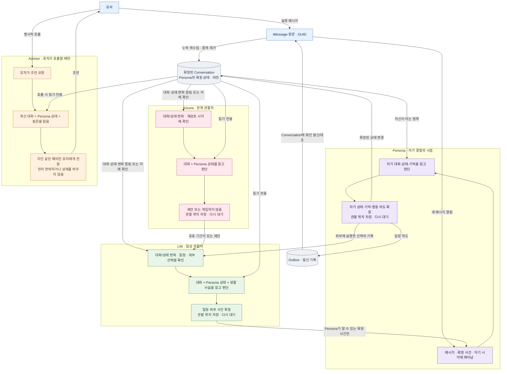
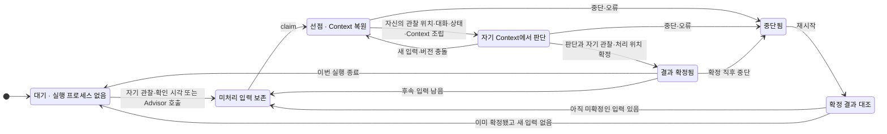

# Agent lifecycle: 입력부터 다음 대기까지

[원본 스펙](agent-runtime.md) · [Context 주입 구조](agent-runtime-architecture.md) · [단계별 API 호출](agent-runtime-api-flow.md)

이것은 **장기 설계의 전체 실행 흐름**이다. 중앙에서 매 턴 담당 Agent를 선택하지 않는다. 대화와 Persona 상태는 지속 기록으로 남고, Persona·Life·Kizuna는 **각자의 관찰 위치와 확인 시각**에 따라 따로 깨어난다. Advisor만 유저가 호출할 때 실행한다. 한 Agent가 내려가 있어도 다른 Agent의 관찰·판단은 계속된다. 실제 HTTP 경로와 프로세스 배치는 아직 정하지 않았다.

## 네 Agent가 각각 이어가는 흐름

**핵심:** `VIEW`는 공유 프롬프트나 중앙의 턴 진행자가 아니라, 각 Agent가 **자기 시각에 읽는 확정된 대화·상태**다. Persona는 자신의 기억과 알게 된 사실을 더해 판단한다. Life·Kizuna·Advisor도 대화와 상태를 보되 각각 자기 Context에서 판단한다. `KC → LW`는 Life가 제안을 검토할 계기이지, 둘이 같은 턴에 실행된다는 뜻이 아니다. Persona의 답장을 확정한 뒤 Agent가 내려가도 발신 작업자는 Outbox를 처리한다. 결과가 불명확하면 [채널 대조](agent-runtime-api-flow.md#3-발신-persona의-의도와-실제-전송-사이) 전 재전송하지 않는다.

## 한 Agent의 실행 상태

위 도면에서 각 Agent에 **따로 적용되는** 상태 전이다. Persona·Life·Kizuna는 자신에게 의미 있는 새 관찰이나 확인 시각으로 깨어나고, Advisor는 유저의 요청으로만 깨어난다. Life가 멈춘다고 Persona까지 내려가는 단일 프로세스 모델이 아니다.

## 각 역할이 한 번 깨어나는 이유와 다음 입력

| 역할        | 깨우는 계기                                                                        | Context에 들어가는 것                                                                                | 확정 결과가 다음에 가는 곳                                      |
| ----------- | ---------------------------------------------------------------------------------- | ---------------------------------------------------------------------------------------------------- | --------------------------------------------------------------- |
| **Persona** | 쌓인 유저 메시지, Persona가 알게 된 생활 사건, 재검토 시각                         | 인물 설정·상태, 해당 Conversation의 Core/단기, 필요할 때만 검색한 장기 기억, 시각순 원문과 확정 사건 | 기억/상태 갱신, 발신 의도는 Outbox, 외부 행동은 Life의 입력     |
| **Life**    | 새 대화·Persona 상태 변화, 일정·시간 도래, Persona의 외부 선택, 유효한 Kizuna 제안 | 실제 대화·Persona의 확정 상태 + 확정 일정·주변 사실·Persona의 외부 선택                              | 확정 사건만 Persona의 영속 입력함; 채택·폐기는 Kizuna 작업 기록 |
| **Kizuna**  | 새 대화·Persona 상태 변화, 재검토 시각                                             | 실제 대화·Persona의 확정 상태 + 기존 제안·근거 사건                                                  | 계기 제안은 Life의 입력; 개입하지 않으면 후속 사건 없음         |
| **Advisor** | 유저의 명시적 조언 요청만                                                          | 호출 시 최신 Conversation·Persona의 확정 상태·유저의 질문                                            | 지인 같은 조언만 유저에게 전달; Persona에게 전달하지 않음       |

Persona의 한 실행에서는 `context.md`의 **Core·단기를 항상** 읽고, 장기 DB는 **Persona·Conversation·인물 ID로 범위를 확인한 뒤 필요할 때만** 검색한다. `민서 (인물 ID: p-42)`의 기억을 이름만 같은 다른 사람에게 주입하지 않는다. Life·Kizuna·Advisor가 상태를 읽을 수 있다는 것이 다른 Agent의 비공개 작업 기록이나 Persona의 주관적 기억 전체를 공유한다는 뜻은 아니다. Kizuna의 기획 의도와 Advisor의 비공개 상담도 Persona에게 전달하지 않는다.

## 복귀 지점은 어디인가

| 중단 시점                          | 복귀 시 확인하는 것                                 | 이어서 할 일                                                         |
| ---------------------------------- | --------------------------------------------------- | -------------------------------------------------------------------- |
| 수신 전·중                         | iMessage 기록과 수신 북마크                         | 누락 메시지를 다시 읽고 GUID로 중복 제거                             |
| Agent 선점 전 또는 판단 중         | 영속 입력함, 확정 버전, 이미 처리된 입력 ID         | 미처리 입력만 현재 시각에서 판단; 확정된 판단을 다시 생성하지 않음   |
| 판단 확정 후, 기억 파일 갱신 중    | 확정 버전과 `context.md`/장기 DB 버전·근거          | 확정된 기억 변경을 대조·복구; 같은 감정 변화를 재적용하지 않음       |
| 발신 전 또는 직후                  | Outbox의 의도·시도·확인 상태와 채널 기록            | 결과 불명확이면 해당 Conversation의 다음 발신을 보류하고 채널과 대조 |
| 오랜 시간 Life·Kizuna·Advisor 중단 | 확정 일정, 제안 유효 기간, 조언 요청 뒤의 최신 대화 | 지나간 일은 따라잡되 낡은 제안·조언을 무작정 실행하지 않음           |

예: Persona가 내려간 13:10·13:15·13:40에 `민서 (인물 ID: p-42)`가 오늘 약속을 제안했다가 취소하고 내일로 바꾸었다. 14:00에 복귀하면 세 메시지의 원문과 발생 시각을 보존한 채 **지금도 유효한 내일 제안**을 보고 판단한다. 장애로 늦게 답했다고 민서의 무응답이나 Persona의 의도적인 무시로 해석하지 않는다.

이 도면의 `claim`, Context 조립, `commit`, Outbox 대조에 대응하는 논리적 호출과 모델 왕복은 [API 호출 순서](agent-runtime-api-flow.md)에 있다. **현재 ADR의 메시지별 프롬프트를 누적 판단과 어떻게 결합할지는 아직 미결정**이며, 도면이 새 전송 형식을 확정하지 않는다.
